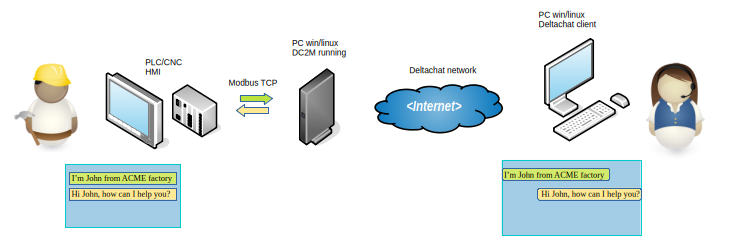

work in progress... please wait for the first release

# **dc2m**

**Dc2m** (Delta Chat to Machine) allows industrial devices (PLCs, PACs, CNCs, etc.) to communicate with IT to provide remote assistance, collect data, and receive alarm notifications directly on your tablet, PC, or smartphone.
In other words, **Dc2m** acts as a bridge between the two worlds. On the one hand, it communicates with industrial devices via the Modbus TCP protocol, and on the other, it interfaces with Delta Chat clients available for PC platforms or Android and iOS mobile devices.

Scenario 1: Human-to-Human Chat

Scenario 2: Data gathering

Scenario 3: Alarm/Event Notification

For those unfamiliar with it, Delta Chat is a decentralized email-based instant messaging service. From a user perspective, it's similar to the more popular WhatsApp, Telegram, and Signal, but it has some unique features that make it an excellent alternative.
First, it's open source, and a large community is ready to provide support in the development of new tools. 
Second, it does NOT require a phone number.
Third: it's a stable, "serious" product without too many frills :)

# System Description
**Dc2m** must be installed on a PC (called a *Station*) with Internet access. The same PC will control the Ethernet network of the industrial devices (called *Channels*), to which it will connect using the Modbus protocol.
In this version of **Dc2m**, each station has three channels for connecting to industrial devices.
**Dc2m** is available for Windows and Linux (deb package).
**Dc2m** is designed to primarily convey text messages. While this is perfectly natural from an IT perspective, from an industrial device perspective, it could involve a little extra work for the PLC program developer. However, I believe this approach can have its advantages in the long run. For example, rather than a notification like "E56 64 60," I'd definitely prefer receiving something like "E56 - Temperature module overload: 64° (max 60°)." The natural language text message sent by the industrial device also opens the way to interaction with AI bots for providing technical assistance in the event of a failure... but here we're talking about a (perhaps) distant future.
However, **Dc2m** is and intends to remain a simple bridge. I don't care what passes through it, if you want to communicate simple numeric codes, you're free to do so.

Let's get back to the text messages...
All these characters must pass through the Modbus connection. To do this, Dc2m only writes and reads holding registers (Modbus codes 03 and 16). The characters can be packed 2 by 2 in each register (recommended solution) or they can occupy the entire register. Each channel can be configured independently for this and other details such as little endian/big endian settings, etc.

# Installation
Binary setup files can find to https://sourceforge.net/projects/dc2m/files

Linux. Deb packages are avaiable. Download them and install with your package manager preferred
from prompt can use dpgk

sudo dpkg -i dc2m_1_.... .deb

Also installer for windows is available. Download the setup_xxx.exe and run it.

# Addressing
By connecting to a station remotely via a delta chat client, we can interact with both the *station* and one of the *channels* it manages. This distinction is made using the prefix $ for the *station* and # for the *channel*. The prefixes must be followed by the *station* or *channel* number (for the station, it is always 1).

Example:
$1... message intended for the station
&raquo;1... message intended for the device connected to channel 1
After specifying the recipient, we can attach one or more command codes, separated by the : character, or we can send a text message, separating it from the recipient with a space.
Example:
$1:5 sends command 5 to the station
\#1:5632 sends command 5632 to channel 1
\#2:45:230:1 sends command 45 to channel 2, attaching it to two numeric values, 230 and 1, which will be interpreted by the device.
\#1 HELLO BOYS I'm sending the text message to channel 1
$1 HELLO USELESS I'm sending the message to the station... but the station doesn't have an interface to display the message, so it will be discarded.

There may be some exceptions; for example, if I write:
\#3 HELLO!
we might receive a response like:
"Sorry, Channel #3 is offline."
Even if the request was intended for a channel, the station checks whether it is reachable before forwarding the message to the device. If not, it notifies the user with a message.

Station Command Codes
A certain number of command codes are planned, and will be increased in future versions. Since we can't know in advance which version of DC2M I'm connected to, the most practical thing to do is ask the station which codes it implements. This is achieved by omitting the command code.
If we write
$1
we'll get something like
Command list:
:1 get name station
:2 list channel active
...

For details on how each code works, refer to the Dc2m online help.

Channel Command Codes
Dc2m simply passes the command code to the specified channel, ignoring its meaning.
It might be nice if, for example, by sending
\#1
the channel 1 device responded with the list of implemented command codes... but this translates into additional work for the PLC programmer, and it might also be advantageous to keep your command codes secret.
